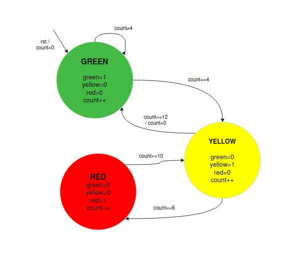
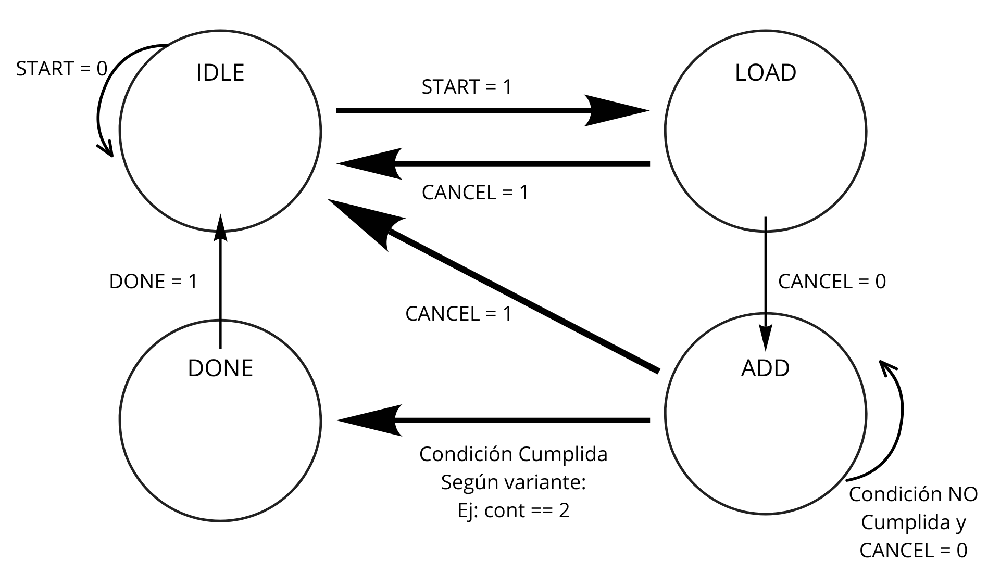
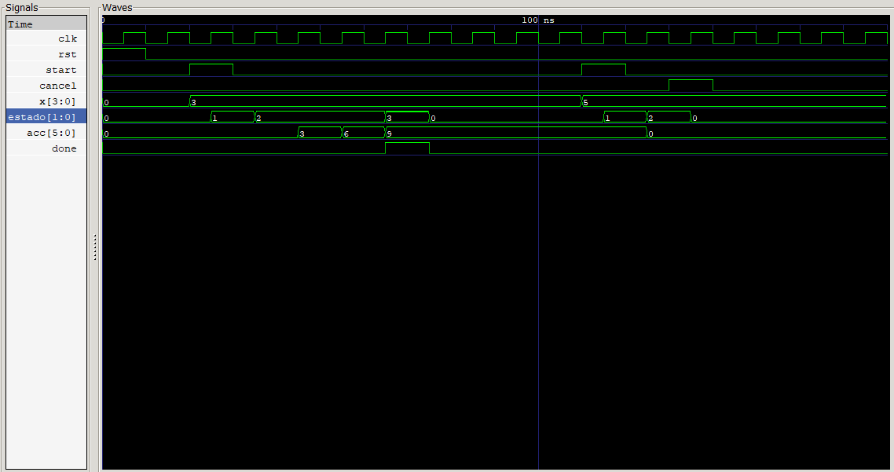
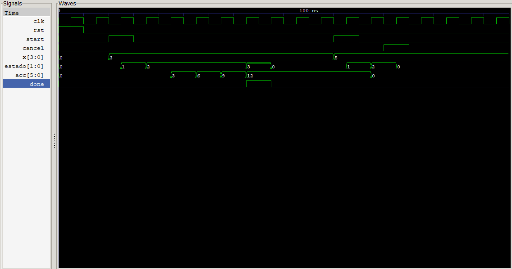
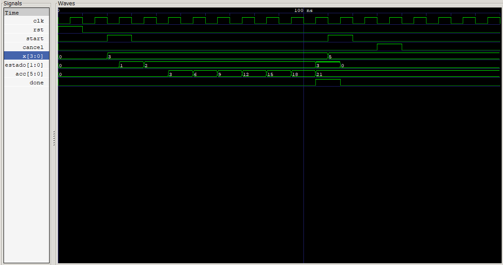

# Laboratorio 00: Introducción a Verilog, Simulación y Máquinas de Estados Finitos (FSM) 
## Introducción a Verilog, Simulación y Máquinas de Estados Finitos (FSM)

Maquinas de estado 
Codigo comentado / explicaciones 
Pantallazo GTK Wave 
Bonus el ASM y lo que pasa con las variables 
---

## Integrantes

- Andres Felipe Castro Lopez – 1014298415
- Juan Pablo Castañeda Moncada - 1000851451
- Angel Manuel Cortavarria Salas – 1044213907

**Grupo de trabajo:** 4  
**Semestre:** 2026-2 

---

## Índice
- [Diseño implementado](#diseño-implementado)
- [Simulaciones](#simulaciones)
- [Implementación](#implementación)
- [Conclusiones](#conclusiones)
- [Referencias](#referencias)

---

## Diseño implementado

Durante el Laboratorio 00 se desarrollaron dos sistemas digitales secuenciales principales empleando el concepto de Máquina de Estados Finitos (FSM) y la integración de una FSM con un bloque de procesamiento de datos (datapath). Los diseños fueron descritos en Verilog y verificados mediante simulación utilizando Icarus Verilog para la compilación y ejecución y GTKWave para la visualización de las señales. La guía del laboratorio tiene como fin el diseño de sistemas que funcionen durante varios ciclos de reloj y comprobar su comportamiento con testbench.

### Ejercicio 1 – FSM de control: semáforo vehicular
El primer diseño es una Máquina de Estados Finitos (FSM) secuencial que controla un semáforo vehicular. El sistema usa el reloj (clk) como referencia de tiempo. También tiene una señal de reset (rst) para fijar el estado inicial. Para cumplir los requisitos de la guia, se usaron acciones de transicion para reiniciar el contador interno cuando viene una señal de reset (rst) o del estado YELLOW a GREEN sin agregar un estado mas, como se observa en la figura.

### Ejercicio 2 – FSM con datapath: acumulador secuencial

El segundo diseño es un sistema tipo FSM con datapath. En este, una máquina de estados controla las operaciones que se hacen sobre un registro acumulador. Este ejercicio permite separar la unidad de control, que es la FSM, del procesamiento de los datos, que lo hace el datapath.
A continuación se presenta la maquina de estados:

## Simulaciones:

### Ejercicio 1: 
Se elaboró un testbench en Verilog, cuyo objetivo es comprobar el correcto funcionamiento de la FSM del semáforo, generando la señal de reloj clk, aplicando la señal de reset rst y permitiendo seguir la evolución del sistema a lo largo de varios ciclos.
Las señales presentes fueron las siguientes:
- clk: señal de reloj.
- rst: señal del reset del sistema.
- green, yellow, red: señales de salida del semáforo.
- state[1:0]: estado actual de la FSM.

La simulación ha permitido observar la secuencia de estados:
Verde ↔ Amarillo ↔ Rojo ↔ Amarillo ↔ Verde
El clock se encarga de controlar la permanencia en cada estado e indica el momento en que se debe realizar una transición como se puede observar en GTKWave, la secuencia se repite correctamente y las salidas son coherentes con el estado de la FSM.

### Resultados Obtenidos
 

### Ejercicio 2
### 1. Descripción del Testbench

El banco de pruebas (`tb_acumulador_sec.v`) fue diseñado para validar tanto el flujo de acumulación normal en todas sus variantes como la lógica de interrupción.

* **Generación de Reloj:** Se configuró un reloj con un período de $10\text{ ns}$ (frecuencia de $100\text{ MHz}$) mediante la directiva `always #5 clk = ~clk;`.
* **Secuencia de Estímulos:**
  1. **Reset Inicial:** Se aplica un pulso en alto a `rst` durante $10\text{ ns}$ para garantizar el estado inicial `IDLE (0)`.
  2. **Ciclo de Acumulación:** Se asigna un valor a la entrada `x[3:0]`, se habilita la señal `start` durante un ciclo de reloj y se deja evolucionar la FSM.
  3. **Prueba de Cancelación:** En un segundo ciclo de operación, se activa la señal `cancel` durante el estado `ADD` para comprobar el retorno inmediato a `IDLE`.

### 2. Señales Observadas

Las señales monitoreadas en el visor de formas de onda GTKWave se dividen en control y datos:

| Señal | Tipo | Descripción / Interpretación en GTKWave |
| :--- | :--- | :--- |
| `clk` | Entrada | Reloj principal del sistema ($T = 10\text{ ns}$). |
| `rst` | Entrada | Reset asíncrono. En nivel alto reinicia la FSM a `IDLE`. |
| `start` | Entrada | Pulso de inicio de la operación de acumulación. |
| `cancel` | Entrada | Señal de aborto de proceso. |
| `x[3:0]` | Entrada | Dato de $4\text{ bits}$ a acumular en cada ciclo. |
| `estado[1:0]` | Interna | Codificación del estado actual de la FSM: • `0`: IDLE \| `1`: LOAD \| `2`: ADD \| `3`: DONE |
| `acc[5:0]` | Salida | Registro acumulador ($6\text{ bits}$) que almacena la suma progresiva. |
| `done` | Salida | Pulso de bandera que indica la finalización exitosa del cálculo. |

### 3. Resultados Obtenidos y Evidencias

A continuación se presentan las capturas de pantalla de las simulaciones correspondientes a las tres variantes de acumulación y a la función de cancelación.

#### Variante 1: Sumar X 3 veces (`VARIANTE = 0`)

En esta configuración, el sistema realiza la suma de $x$ durante 3 ciclos de reloj en el estado `ADD (2)`.

* **Análisis del resultado:**
  * Con $x = 3$, al presionar `start`, la FSM pasa de `IDLE (0)` a `LOAD (1)` y luego a `ADD (2)`.
  * La señal `acc` incrementa en pasos de $3$: $0 \rightarrow 3 \rightarrow 6 \rightarrow 9$.
  * Al completar los 3 ciclos, el sistema pasa al estado `DONE (3)`, donde se activa `done = 1` por un ciclo.
  * **Prueba de Cancelación:** En la segunda ráfaga con $x = 5$, la activación de `cancel` interrumpe el proceso, regresando la FSM a `IDLE (0)` y limpiando `acc` a $0$.

#### Variante 2: Sumar X 4 veces (`VARIANTE = 1`)

En esta configuración, la acumulación se ejecuta durante 4 ciclos consecutivos antes de finalizar.

* **Análisis del resultado:**
  * Para una entrada constante $x = 3$, el acumulador evoluciona secuencialmente: $0 \rightarrow 3 \rightarrow 6 \rightarrow 9 \rightarrow 12$.
  * Cumplidos los 4 ciclos requeridos, se alcanza el estado `DONE (3)` activando la bandera de salida `done`.

#### Variante 3: Sumar hasta que acc mayor o igual a 20 (`VARIANTE = 2`)

En esta configuración, el Datapath evalúa en cada ciclo si la suma acumulada alcanzará o superará el umbral de $20$.

* **Análisis del resultado:**
  * Con entrada $x = 3$, el sistema acumula sucesivamente: $3, 6, 9, 12, 15, 18, 21$.
  * Al alcanzar $21$ ($21 \ge 20$), la condición de parada se cumple y la FSM transita inmediatamente al estado `DONE (3)`, activando el pulso `done`.

### Ejercicio 3:

## Implementación

### Ejercicio 1:

El diseño se divide en dos archivos:
- [semaforo.v](./src/semaforo.v): contiene el módulo principal de la FSM
- [tb_semaforo.v](./src/tb_semaforo.v): contiene el testbench de verificación

El módulo semaforo.v está organizado en dos bloques always:
el primero maneja la lógica secuencial (cambio de estados y contador), y el segundo maneja las salidas combinacionales.

El sistema opera en el flanco positivo del reloj (posedge clk).
El reset es asíncrono ya que esta en la lista sensitiva junto al clock y activo alto — al activarse, el sistema regresa inmediatamente al estado GREEN con count=0,independientemente del estado actual.

Los estados se codificaron con localparams de 2 bits:
S0_GREEN=00, S1_YELLOW=01, S2_RED=10.

El contador count es una variable interna de 4 bits que se incrementa en cada ciclo de reloj sin resetearse al cambiar de estado — esto permite usar valores absolutos como umbrales de transición (count==4, count==6, count==10, count==12).

Las salidas green, yellow y red se calculan en un bloque
always @(*) separado — esto garantiza que son señales Moore
puras, es decir, dependen únicamente del estado actual y sean puramente combinacionales.

La única excepción al comportamiento acumulado del contador
es la transición de YELLOW a GREEN cuando count==12, donde
se resetea a 0 para comenzar el siguiente ciclo completo.

### Ejercicio 2:
### Implementación del Diseño en Verilog
El acumulador secuencial se implementó mediante una arquitectura **FSM con Datapath** síncrona. El detalle técnico línea por línea se encuentra comentado directamente en el código fuente dentro de la carpeta [`src/`](./src/).

#### 1. Estructura y Código Fuente

* **Módulo Principal:** [`src/acumulador_sec.v`](./src/acumulador_sec.v)  
  Contiene el control por FSM (`IDLE`, `LOAD`, `ADD`, `DONE`), la lógica del Datapath (sumador/contador) y el soporte para la señal de cancelación.
* **Banco de Pruebas:** [`src/tb_acumulador_sec.v`](./src/tb_acumulador_sec.v)  
  Genera el reloj de $10\text{ ns}$, el reset asíncrono y los estímulos de prueba para generar el archivo de ondas para GTKWave.

#### 2. Puntos Clave del Hardware

* **Reloj y Reset:** Operación síncrona en flanco de subida (`posedge clk`) con reset asíncrono activo en alto (`rst`) que fuerza el estado inicial `IDLE (0)`.
* **Flujo del Sistema:** Tras recibir `start = 1`, la FSM limpia los registros en `LOAD`, ejecuta las sumas en `ADD` según el parámetro `VARIANTE`, emite el pulso `done = 1` en `DONE` y retorna automáticamente a `IDLE`[cite: 2, 3, 4]. La señal `cancel = 1` interrumpe el proceso en cualquier punto.

---

## Conclusiones
Como punto de partida del laboratorio, logramos instalar y verificar el correcto funcionamiento de Icarus Verilog y GTKWave, confirmando que tenemos el entorno listo para simular y analizar señales digitales sin problemas. Familiarizarnos con estas herramientas desde el principio es clave, ya que nos da la base para poder validar el comportamiento temporal de cualquier diseño antes de pensar en implementarlo en hardware físico.

Hablando del ejercicio 2, desarrollar el acumulador secuencial hizo mucho más clara la diferencia práctica entre usar lógica combinacional (para calcular las sumas o el próximo estado) y lógica secuencial (para guardar los datos en cada flanco de reloj). Diseñar la máquina de estados (FSM) conectada al Datapath nos ayudó a entender cómo coordinar un sistema que opera a lo largo de varios ciclos de reloj, asegurando que pase por sus estados correctamente (IDLE, LOAD, ADD, DONE), retenga el resultado al terminar y reaccione bien a señales como la cancelación. Al final, armar el testbench y revisar las ondas generadas nos demostró que la simulación es un paso obligatorio para cazar y corregir errores lógicos a tiempo.

---

## Referencias

[1]: S. L. Harris y D. Harris, *Digital Design and Computer Architecture: RISC-V Edition*. Waltham, MA, USA: Morgan Kaufmann, 2021.

